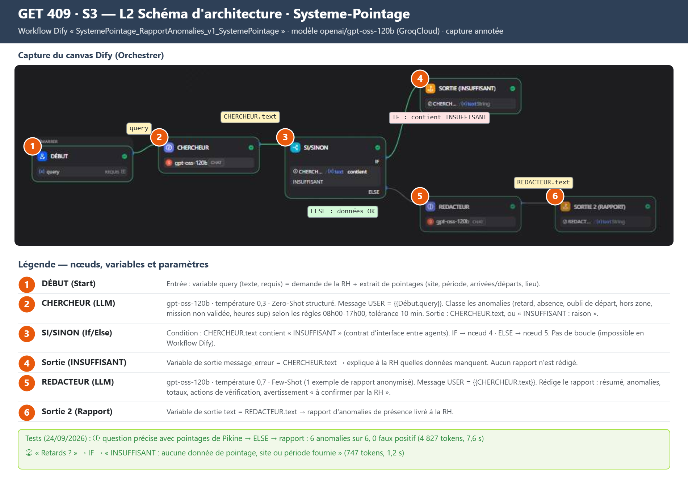
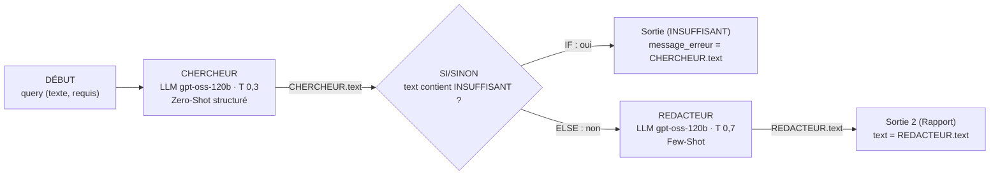

# Agent IA Dify — Systeme-Pointage (Livrables L1 & L2 · S3)

> Séance 3 — Architecture multi-agents avec Dify · Outil : [dify.ai](https://cloud.dify.ai) (plan Sandbox) · Modèle : `openai/gpt-oss-120b` via GroqCloud
> User story servie : **US-03** — récapitulatif mensuel : « Dify : agent qui signale les anomalies du mois » ([backlog-s3.md](../backlog-s3.md))

## L1 — Agent V1 fonctionnel

| Élément | Valeur |
|---|---|
| Nom de l'application | `SystemePointage_RapportAnomalies_v1_SystemePointage` |
| Type d'application | Flux de travail (Workflow) |
| URL publique | https://udify.app/workflow/bA2Q10oxJqQJP8Up |
| Entrée | `query` (texte) : la demande de la RH + l'extrait de pointages à analyser |
| Sortie (données OK) | `text` : rapport d'anomalies de présence |
| Sortie (données insuffisantes) | `message_erreur` : `INSUFFISANT : [raison]` |

### Ce que fait l'agent

La responsable RH (persona : Ndèye Fatou Sarr) colle l'extrait de pointages d'un site sur une période. L'agent **Chercheur** repère chaque anomalie (retard, absence, oubli de départ, pointage hors zone, mission non validée, heures sup). Si les données ne suffisent pas, il répond `INSUFFISANT`. Sinon, l'agent **Rédacteur** transforme ces données en un rapport clair avec des actions de vérification. Le rapport ne propose **jamais de sanction automatique**.

### Tests réalisés (24/09/2026, mode test Dify)

| # | Question | Branche | Nœuds exécutés | Résultat | Tokens | Durée |
|---|---|---|---|---|---|---|
| 1 | Pointages de l'agence de Pikine, 15 au 19/09 ([jeu de test](./jeu-de-test.md)) | ELSE | Début → CHERCHEUR → SI/SINON → REDACTEUR → Sortie 2 | ✅ Rapport complet : 6 anomalies sur 6, 0 faux positif | 4 827 | 7,6 s |
| 2 | « Retards ? » | IF | Début → CHERCHEUR → SI/SINON → Sortie (INSUFFISANT) | ✅ `INSUFFISANT : aucune donnée de pointage, site ou période fournie dans le message.` | 747 | 1,2 s |

<details>
<summary>Sortie complète du test 1 (rapport généré par l'agent)</summary>

```text
RAPPORT D'ANOMALIES DE PRÉSENCE — SYSTEME-POINTAGE
Site : agence de Pikine · Période : 15 au 19 septembre 2026

RÉSUMÉ
3 employés et 7 pointages analysés. 6 anomalies à vérifier, dont 1 absence et 1 oublis de départ.
Les pointages du 18/09 et du 19/09 sont non disponibles.

ANOMALIES À VÉRIFIER
· Moussa Fall — 16/09 — Retard : arrivée 08h31 (+21 min)
· Moussa Fall — 17/09 — Oubli de départ : arrivée 08h02, aucun départ
· Aïssatou Ba — 15/09 — Heures sup : 1 h 40 (17h30‑19h10)
· Cheikh Ndiaye — 15/09 — Hors zone : pointage à Guédiawaye (hors site prévu)
· Cheikh Ndiaye — 16/09 — Mission non validée : mission client non validée par le chef d'équipe
· Cheikh Ndiaye — 17/09 — Absence : aucun pointage

TOTAUX DE LA PÉRIODE
Retards : 1 · Absences : 1 · Oublis de départ : 1 · Hors zone : 1 · Missions non validées : 1 · Heures sup : 1 h 40

ACTIONS RECOMMANDÉES
1. Confirmer avec Moussa Fall son heure de départ du 17/09 et enregistrer la correction.
2. Vérifier auprès du chef d'équipe la validation de la mission du 16/09 de Cheikh Ndiaye.
3. Contrôler avec le responsable de site la présence prévue de Cheikh Ndiaye le 15/09 (hors zone) et le 17/09 (absence).
4. Faire valider les heures sup du 15/09 d'Aïssatou Ba avant la paie.
5. Collecter les pointages manquants du 18/09 et du 19/09 pour compléter le suivi.

⚠️ Rapport généré par IA à partir des pointages fournis. Chaque anomalie doit être confirmée par la RH avant toute retenue sur salaire. L'employé peut demander une correction avec justificatif.
```

</details>

### Captures d'écran (dans `livrables/captures-s3/`)

| Fichier | Contenu |
|---|---|
| `L1_test1_entree.png` | Question 1 saisie dans l'application publiée |
| `L1_test1_sortie.png` | Rapport d'anomalies généré |
| `L1_test2_insuffisant.png` | Question « Retards ? » → réponse INSUFFISANT |

## L2 — Schéma d'architecture





| Nœud | Type | Rôle | Entrée | Sortie |
|---|---|---|---|---|
| DÉBUT | Start | Recevoir la demande de la RH et l'extrait de pointages | saisie utilisateur | `query` |
| CHERCHEUR | LLM | Analyser les pointages et classer les anomalies selon les règles (horaires, tolérance de 10 min) | `query` (message USER) | `CHERCHEUR.text` (données structurées ou `INSUFFISANT : …`) |
| SI/SINON | If/Else | Contrôler la qualité : bloquer le rapport si les données manquent | `CHERCHEUR.text` | branche IF / ELSE |
| Sortie (INSUFFISANT) | End | Expliquer à la RH ce qui manque | `CHERCHEUR.text` | `message_erreur` |
| REDACTEUR | LLM | Rédiger le rapport d'anomalies et les actions de vérification | `CHERCHEUR.text` (message USER) | `REDACTEUR.text` |
| Sortie 2 (Rapport) | End | Livrer le rapport final | `REDACTEUR.text` | `text` |

### Choix d'architecture

- **Deux agents spécialisés** : le Chercheur, à température basse, *compte* et le Rédacteur, à température plus haute, *explique*. On sépare l'analyse, qui doit être exacte, de la rédaction, qui doit être lisible.
- **Contrat d'interface `INSUFFISANT`** : c'est un mot-clé fixe entre le Chercheur et le SI/SINON. Sans données, aucun rapport n'est rédigé, ce qui évite qu'un rapport inventé serve à une retenue sur salaire.
- **Pas de boucle de relance** : dans un Workflow Dify, une branche ne peut pas revenir vers un nœud précédent (tutoriel, erreur #3). La branche IF s'arrête donc avec un message qui dit à la RH quoi fournir.
- **Variables uniquement dans les messages USER** : jamais dans le SYSTEM, pour éviter les erreurs `#sys.query# not found` et `#Chercheur.text# not found`.

## Difficultés rencontrées et solutions

| Difficulté | Cause | Solution |
|---|---|---|
| Le workflow ne produisait rien | Prompts SYSTEM vides, nœud REDACTEUR branché *après* Sortie 2 | Prompts rédigés ; ordre corrigé : ELSE → REDACTEUR → Sortie 2 |
| La branche IF ne se déclenchait jamais | Faute de frappe dans la condition : `INSUFISSANT` | Valeur corrigée : `INSUFFISANT` |
| Sorties vides | Aucune variable de sortie dans les nœuds Sortie | `message_erreur` (IF) et `text` (ELSE) ajoutées |
| `model_not_found` (erreur 404) | Kimi-K2 puis Llama-3.1-8b-instant ne sont plus accessibles avec notre clé Groq | Modèles testés un par un : seuls les `gpt-oss` répondent → `openai/gpt-oss-120b` |

## Amélioration envisagée pour la V2

1. Calculer les totaux (retards, heures sup) **dans l'application Bolt.new**, de façon déterministe, et laisser au LLM la seule rédaction du rapport. Un modèle de langage peut se tromper dans un calcul.
2. Passer en **Chatflow** pour permettre une relance guidée (« il manque les pointages du 18/09, voulez-vous les ajouter ? »).
3. Remplacer les noms par des **matricules** avant l'envoi au modèle (voir la [réflexion éthique](./reflexion-ethique.md)).
