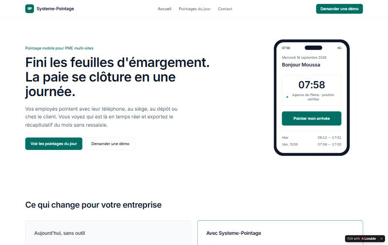
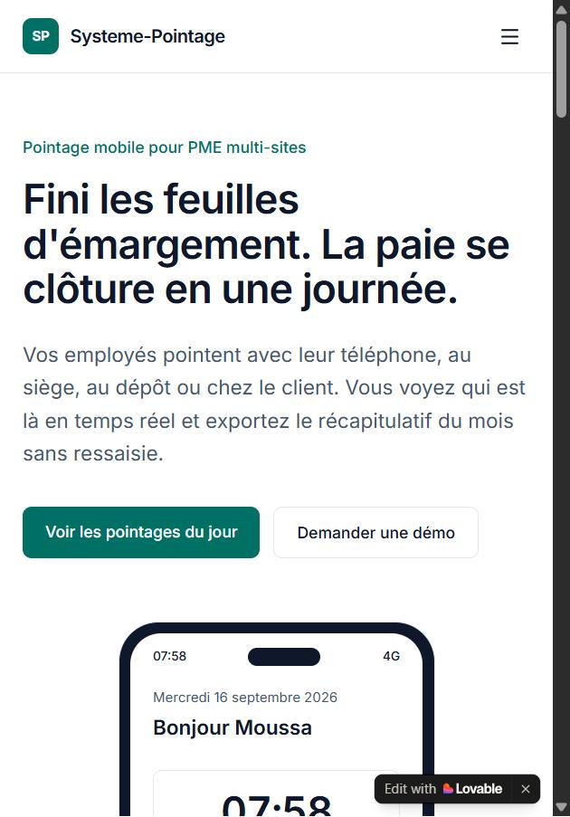
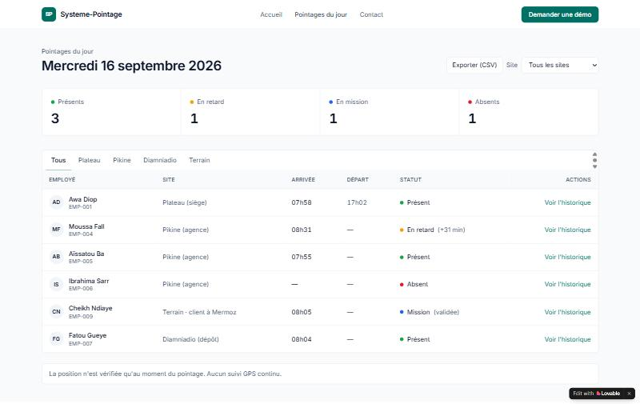
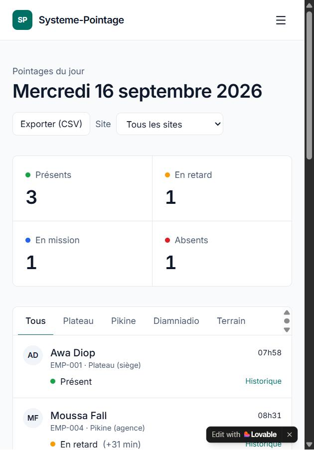

# Séance 4 — MVP V1 Systeme-Pointage (Lovable.dev)

> Livrables S4 : **L1** MVP en ligne · **L2** projet public + README · **L3** journal de prompts · **L4** captures + note d'itération.

| Élément | Valeur |
|---|---|
| URL du MVP (L1) | <https://exact-screen-match-154.lovable.app> — publiée, « visible par toute personne ayant le lien » |
| Outil | Lovable.dev (React + Tailwind CSS + Vite + React Router, données JSON locales, sans backend) |
| Pages | Accueil · Pointages du jour (`/pointages`) · Contact (`/contact`) |
| Journal de prompts (L3) | [journal-prompts.md — Séance 4](../../journal-prompts.md#séance-4--journal-de-prompts-livrable-l3--mvp-lovable) |
| Captures (L4) | [livrables/captures-s4/](../../livrables/captures-s4/) |
| Données | 6 employés fictifs de démonstration, mercredi 16/09/2026 — mêmes matricules et sites que la base de connaissances de l'agent Dify (S3) |

## Fonctionnalités testables

1. **Filtres par site** (Tous · Plateau · Pikine · Diamniadio · Terrain) + sélecteur de site, avec compteurs du jour (Présents 3 · En retard 1 · En mission 1 · Absents 1).
2. **Historique d'un employé** : « Voir l'historique » ouvre un panneau avec les 5 derniers pointages.
3. **Export CSV** des pointages affichés (`pointages-2026-09-16.csv`).
4. **Formulaire de demande de démo** avec message de confirmation (sans envoi réel).

## Checklist du template (6 points)

| ✓ | Test | Constaté |
|---|---|---|
| ✅ | Nom de l'app dans le header | Logo « SP » + Systeme-Pointage |
| ✅ | Navigation 3 pages | Accueil · Pointages du jour · Contact (menu burger sur mobile) |
| ✅ | Hero + 2 CTA | « Voir les pointages du jour » / « Demander une démo » |
| ✅ | 6 éléments + pastilles | 6 employés, pastilles Présent (vert) · Mission (bleu) · En retard (ambre) · Absent (rouge) |
| ✅ | Filtres fonctionnels | Onglets par site |
| ✅ | Formulaire Contact | 6 champs + bouton couleur principale + adresse (coordonnées fictives) |

> Écart assumé avec le template : pas de logo emoji et un **tableau** au lieu de grosses cartes, pour que le MVP ressemble à un logiciel RH réel (voir note d'itération).

## Captures (L4)

| Ordinateur (1440 px) | Mobile |
|---|---|
|  |  |
|  |  |

## Note d'itération (L4) — ce que nous avons changé et pourquoi

**1. Refonte complète après le premier prompt.** Le prompt du template a produit une application correcte mais au look « généré » : logo emoji, grandes cartes, héros centré avec trois chiffres. Pour une responsable RH comme Ndèye Fatou, un outil de paie doit inspirer confiance. Nous avons donc relancé la génération avec une direction artistique inspirée de logiciels RH réels (Jibble, Connecteam, Deputy, Factorial) : monogramme « SP », maquette de l'écran de pointage, tableau dense pour la RH, une seule couleur forte (#0F766E). Nous en avons profité pour aligner les données sur la base de connaissances de l'agent Dify (EMP-006 à Pikine, EMP-007 à Diamniadio), afin que le MVP et l'agent racontent la même semaine.

**2. Une correction factuelle (P1).** Notre prompt indiquait « Mardi 16 septembre 2026 » : c'est un mercredi. Lovable a recopié l'erreur. Une date fausse se remarque à l'oral et décrédibilise un outil de pointage, d'où une correction ciblée.

**3. Rendre le problème visible (P2).** En relisant l'accueil, on comprenait ce que fait l'application, mais pas **ce qui se passait avant**. La section « Aujourd'hui, sans outil / Avec Systeme-Pointage » reprend les Pains et Pain relievers de notre VPC (feuille d'émargement, WhatsApp, Excel, 3 à 4 jours de paie, litiges).

**4. Une 2ᵉ fonctionnalité utile à la paie (P3).** Le bouton « Exporter (CSV) » répond à la user story US-03 (« export pour la paie »). Ses colonnes sont celles de la base de l'agent Dify, ce qui prépare l'intégration MVP ↔ agent de la séance 5.

**Mobile.** 70 % des utilisateurs au Sénégal sont sur smartphone et les employés pointent depuis leur téléphone : nous avons vérifié que le tableau devient une liste compacte et que la navigation passe en menu burger.

**Incident.** Un prompt destiné à une autre maquette a été envoyé par erreur dans le projet ; nous sommes revenus à la bonne version avec **Revert to this version** avant les itérations. Leçon : vérifier l'URL publiée après chaque session.

## Éthique (rappel S4)

- **Données :** uniquement des données fictives de démonstration ; le formulaire Contact n'envoie rien.
- **Vie privée :** le MVP affiche « La position n'est vérifiée qu'au moment du pointage. Aucun suivi GPS continu. » (loi n° 2008-12, CDP).
- **Accessibilité :** fonctionne sur smartphone, sans application à installer.
