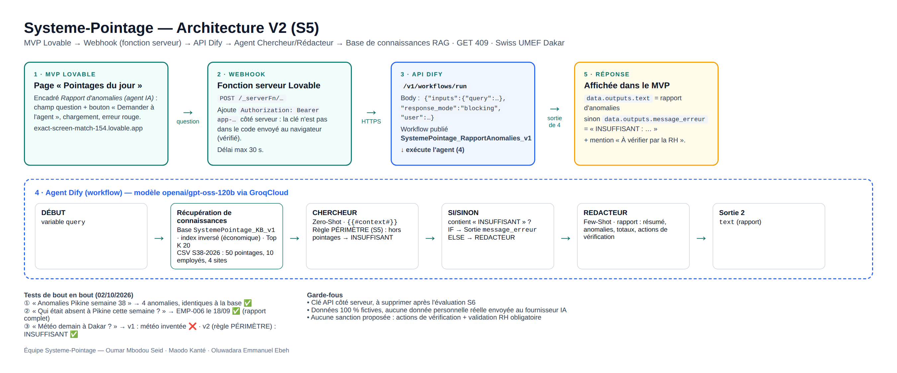
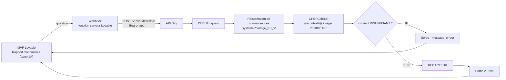
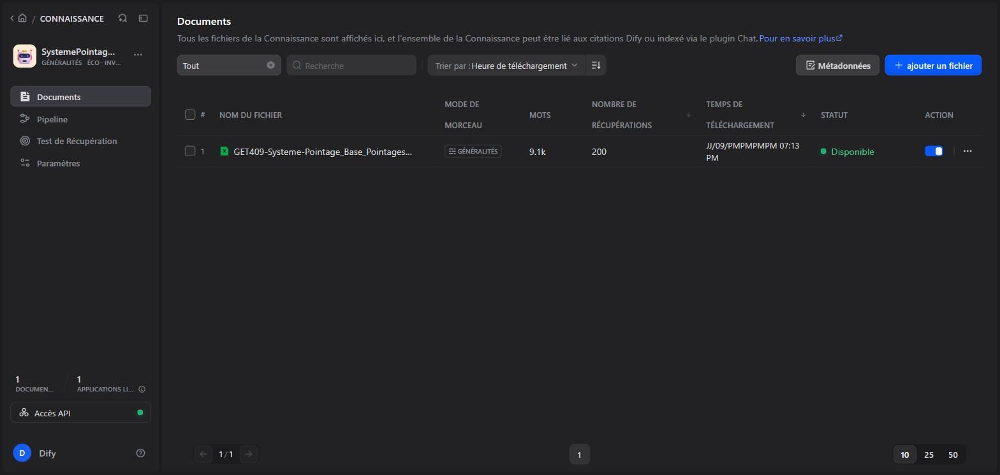
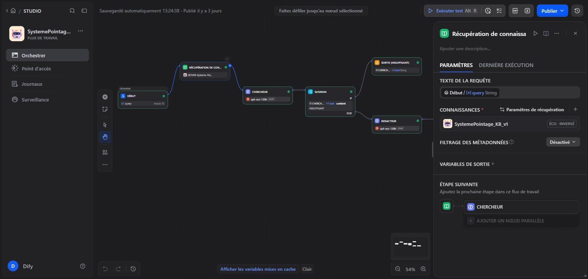
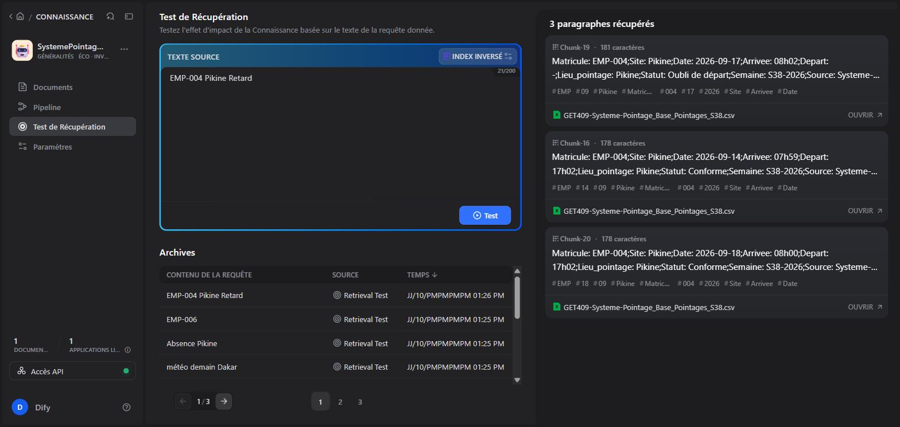

# Séance 5 — MVP V2 : intégration Lovable ↔ agent Dify + RAG

> Livrables S5 : **L1** MVP V2 en ligne avec l'agent · **L2** pipeline RAG opérationnel · **L3** schéma d'architecture V2 · **L4** journal de prompts S5.

| Élément | Valeur |
|---|---|
| MVP V2 (L1) | <https://exact-screen-match-154.lovable.app/pointages> → encadré « Rapport d'anomalies (agent IA) » |
| Workflow Dify (L2) | <https://cloud.dify.ai/app/abf9189b-1500-4dd5-9e2f-e4c1dbe2123d/workflow> — `SystemePointage_RapportAnomalies_v1_SystemePointage` (publié) |
| Base de connaissances | `SystemePointage_KB_v1` — `GET409-Systeme-Pointage_Base_Pointages_S38.csv` (50 pointages fictifs, 10 employés, 4 sites, S38-2026) · statut **Disponible** · mode économique, index inversé |
| API | `POST https://api.dify.ai/v1/workflows/run` — appelée par une fonction serveur Lovable (clé non exposée au navigateur) |
| Schéma V2 (L3) | [livrables/GET409-Systeme-Pointage_L3_Architecture_V2_S5.png](../../livrables/GET409-Systeme-Pointage_L3_Architecture_V2_S5.png) |
| Journal (L4) | [journal-prompts.md — Séance 5](../../journal-prompts.md#séance-5--journal-de-prompts-livrable-l4--rag--intégration-mvp--dify) |

## L3 — Architecture V2

## L2 — Pipeline RAG (captures)

| Base indexée (Disponible) | Agent connecté à la base |
|---|---|
|  |  |

Test de récupération « EMP-004 Pikine Retard » : 

## L1 — Tests de bout en bout dans le MVP (02/10/2026)

| # | Question | Résultat | Capture |
|---|---|---|---|
| 1 | Anomalies Pikine semaine 38 | ✅ 4 anomalies, identiques à la base | [S5_L1_test1_donnees.jpg](../../livrables/captures-s5/S5_L1_test1_donnees.jpg) |
| 2 | Qui était absent à Pikine cette semaine ? | ✅ EMP-006 le 18/09 | [S5_L1_test2_indirect.jpg](../../livrables/captures-s5/S5_L1_test2_indirect.jpg) |
| 3 | Météo demain à Dakar ? | ✅ « INSUFFISANT : demande hors du périmètre des pointages » (après correction du prompt, voir P12) | [S5_L1_test3_hors_base.jpg](../../livrables/captures-s5/S5_L1_test3_hors_base.jpg) |

## Éthique (préparation de la note S6)

- **Clé API :** gardée côté serveur par Lovable ; écrite dans le code du projet → à supprimer dans Dify (Point d'accès → Clé API) après l'évaluation S6.
- **Données :** 100 % fictives ; en production, les pointages réels sont des données personnelles (loi n° 2008-12, CDP) : anonymiser ou héberger le modèle localement avant tout envoi à un fournisseur étranger.
- **Hallucination :** test hors base obligatoire ; règle PÉRIMÈTRE ajoutée au CHERCHEUR.
- **Décision humaine :** le rapport ne propose que des vérifications, avec la mention « À vérifier par la RH avant toute décision ».
- **Plan B S6 :** si l'API ne répond pas, montrer les captures des 3 tests ci-dessus.
